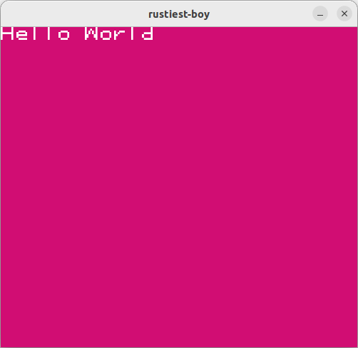

# rustiest-boy

Yet another GameBoy emulator built in Rust

## Goals

To build a cross platform GameBoy Color emulator in Rust.

 - Support for desktop platforms and .wasm
 - Support for most gameboy color cartridge types and basic features
 - [Farfetch'd](https://assets.pokemon.com/assets/cms2/img/pokedex/full/083.png): Support for more advanced features such as: link cable emulation, save data & audio

I'm building this with the intention of learning about rust, the whole .wasm thing & (gameboy) emulation.

## Building

### Linux

 - Install sdl2 `sudo apt install libsdl2-dev`
 - Install sdl2-ttf `sudo apt-get install libsdl2-ttf-dev`

 Run `cargo run`

<i >Amazing demo window with text</i>

